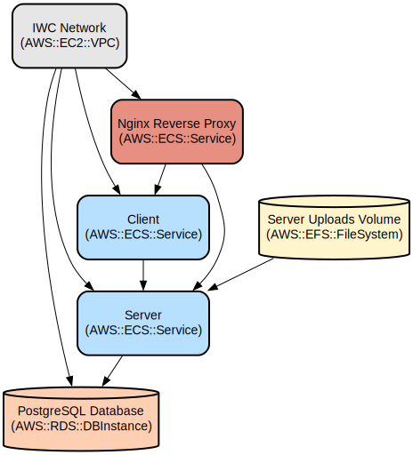

# IWC Learning Platform: A Comprehensive English Language Assessment and Learning System

The IWC Learning Platform is a modern web-based solution that empowers students to master English through instructor-created assessments, detailed feedback, and comprehensive progress tracking. It combines robust assessment capabilities with sophisticated proficiency tracking to provide a personalized learning experience.

The platform features a React-based frontend with Material-UI components for an intuitive user interface, and a Node.js/Express backend with PostgreSQL for data persistence. It supports multiple user roles (students, instructors, and administrators), real-time assessment tracking, and detailed progress analytics across various language skills including vocabulary, grammar, reading, listening, speaking, and writing.

## Repository Structure
```
.
├── client/                      # React frontend application
│   ├── src/
│   │   ├── components/         # Reusable UI components
│   │   ├── contexts/          # React context providers (auth, etc.)
│   │   ├── interfaces/        # TypeScript type definitions
│   │   ├── pages/            # Main application views
│   │   └── utils/            # Helper functions and API clients
├── server/                     # Express backend application
│   ├── src/
│   │   ├── controllers/       # Request handlers for each route
│   │   ├── db/               # Database migrations and seeds
│   │   ├── middleware/       # Express middleware (auth, etc.)
│   │   └── routes/           # API route definitions
└── docker-compose.yml         # Docker composition for all services
```

## Usage Instructions
### Prerequisites
- Docker and Docker Compose
- Node.js 18.x or higher
- PostgreSQL 13 or higher
- npm or yarn package manager

### Installation

1. Clone the repository:
```bash
git clone <repository-url>
cd iwc-learning-platform
```

2. Install dependencies:
```bash
# Install root dependencies
npm install

# Install client dependencies
cd client
npm install

# Install server dependencies
cd ../server
npm install
```

3. Configure environment variables:
```bash
# Create .env file in root directory
cp .env.example .env

# Set required environment variables
REACT_APP_API_URL=http://localhost:5000
POSTGRES_USER=your_db_user
POSTGRES_PASSWORD=your_db_password
POSTGRES_DB=iwc_learning
JWT_SECRET=your_jwt_secret
```

4. Start the application using Docker:
```bash
docker-compose up -d
```

### Quick Start
1. Access the application at http://localhost:80
2. Register a new account as either a student or instructor
3. For students:
   - Take assessments from the Assessments page
   - Track progress in the Proficiency Tracking section
4. For instructors:
   - Create new assessments from the Dashboard
   - Monitor student progress and results

### More Detailed Examples
1. Creating an Assessment (Instructors):
```typescript
// Example assessment creation
const assessment = {
  title: "Beginner Vocabulary",
  description: "Test basic English vocabulary",
  level: "A1",
  questions: [
    {
      type: "multiple-choice",
      text: "What is the opposite of 'hot'?",
      options: ["cold", "warm", "cool", "freezing"]
    }
  ]
};
```

2. Taking an Assessment (Students):
- Navigate to Assessments page
- Select an assessment
- Complete questions within the time limit
- Submit for immediate feedback

### Troubleshooting
1. Database Connection Issues
```bash
# Check database logs
docker-compose logs db

# Verify database connection
docker exec -it iwc-db psql -U postgres -d iwc_learning
```

2. API Connection Errors
- Verify REACT_APP_API_URL is correctly set
- Check server logs: `docker-compose logs server`
- Ensure all services are running: `docker-compose ps`

## Data Flow
The platform processes assessment data and user interactions through a structured pipeline that ensures accurate progress tracking and feedback delivery.

```ascii
[Client Browser] -> [React Frontend] -> [Express API] -> [PostgreSQL]
     ^                    |                  |              |
     |                    v                  v              v
[User Interface] <- [State Management] <- [Controllers] <- [Data Models]
```

Key component interactions:
1. Authentication flow through JWT tokens
2. Real-time assessment progress tracking
3. Automated scoring and feedback generation
4. Progress analytics calculation and visualization
5. File upload handling for assessment materials
6. User role-based access control
7. Proficiency level tracking and updates

## Infrastructure


### Database Resources
- PostgreSQL database with tables for:
  - Users (students, instructors, admins)
  - Assessments and questions
  - Proficiency tracking
  - User progress and achievements

### Docker Services
- `nginx`: Reverse proxy (port 80)
- `client`: React frontend container
- `server`: Node.js/Express backend container
- `db`: PostgreSQL database container

### Storage
- `server-uploads`: Persistent volume for uploaded files
- `iwc-network`: Docker network for service communication