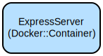

The platform offers comprehensive assessment management features including:
- Role-based access control with JWT authentication
- Assessment creation with customizable parameters (duration, difficulty level, themes)
- Automated grading for multiple-choice questions
- Manual grading capabilities for essay questions
- Detailed submission tracking and result analysis
- RESTful API architecture with input validation
- Secure database operations with PostgreSQL

## Repository Structure
```
.
├── src/                          # Source code directory
│   ├── app.js                    # Application entry point and Express configuration
│   ├── config.js                # Environment configuration with Zod validation
│   ├── controllers/             # Request handlers for different routes
│   ├── middleware/              # Custom middleware (auth, validation, error handling)
│   ├── models/                  # Database models and relationships
│   ├── routes/                  # Route definitions for different user roles
│   ├── services/               # Business logic implementation
│   └── validation/             # Request validation schemas
├── tests/                      # Test suites for components
├── public/                     # Static assets
├── coverage/                   # Test coverage reports
└── Dockerfile                  # Multi-stage Docker build configuration
```

### Quick Start
1. Register an admin user:
```bash
curl -X POST http://localhost:5000/auth/register \
  -H "Content-Type: application/json" \
  -d '{
    "username": "admin",
    "email": "admin@example.com",
    "password": "secure_password",
    "role": "admin"
  }'
```

2. Login to get JWT token:
```bash
curl -X POST http://localhost:5000/auth/login \
  -H "Content-Type: application/json" \
  -d '{
    "identifier": "admin@example.com",
    "password": "secure_password"
  }'
```

3. Create an assessment (as instructor):
```bash
curl -X POST http://localhost:5000/instructor/assessments \
  -H "Authorization: Bearer <your-jwt-token>" \
  -H "Content-Type: application/json" \
  -d '{
    "title": "Sample Assessment",
    "description": "Test assessment",
    "open_at": "2024-01-01T00:00:00Z",
    "close_at": "2024-01-02T00:00:00Z",
    "duration_minutes": 60,
    "level": "B",
    "theme": "education"
  }'
```

### More Detailed Examples
#### Adding Questions to an Assessment
```bash
curl -X PUT http://localhost:5000/instructor/assessments/:id \
  -H "Authorization: Bearer <your-jwt-token>" \
  -H "Content-Type: application/json" \
  -d '{
    "questions": [
      {
        "prompt": "What is the capital of France?",
        "type": "multiple_choice",
        "points": 10,
        "options": ["London", "Paris", "Berlin", "Madrid"],
        "correct_answer": "Paris"
      }
    ]
  }'
```

### Troubleshooting

#### Common Issues
1. Database Connection Errors
```
Error: Unable to connect to DB
```
- Verify DATABASE_URL in .env
- Ensure PostgreSQL is running
- Check network connectivity
- Verify database user permissions

2. Authentication Failures
```
Error: Invalid token
```
- Verify JWT_SECRET in .env
- Check token expiration
- Ensure proper token format in Authorization header

#### Debug Mode
Enable debug logging:
```bash
# In .env
DEBUG=app:*
NODE_ENV=development
```

Log files location:
- Application logs: `./logs/app.log`
- Error logs: `./logs/error.log`

## Data Flow
The system processes assessments and submissions through a structured pipeline that ensures data integrity and proper access control.

```ascii
User Request → Auth Middleware → Role Validation → Controller → Service Layer → Database
     ↑                                                             |
     └─────────────────────── Response ←────────────────────────←─┘
```

Key Component Interactions:
1. Authentication middleware validates JWT tokens
2. Role middleware ensures proper access permissions
3. Controllers handle request/response lifecycle
4. Services implement business logic and data operations
5. Models define database schema and relationships
6. Validation schemas ensure data integrity
7. Error middleware provides consistent error handling

## Infrastructure


### Docker Resources
- Base Image: `node:18-alpine`
- Multi-stage build:
  - Builder stage: Installs dependencies and runs tests
  - Production stage: Creates lean production image
- Exposed Port: 5000
- Environment Variables:
  - NODE_ENV
  - DATABASE_URL
  - JWT_SECRET

## Deployment
### Prerequisites
- Docker
- PostgreSQL database
- Environment variables configured

### Deployment Steps
1. Build Docker image:
```bash
docker build -t assessment-system:latest .
```

2. Deploy container:
```bash
docker run -d \
  --name assessment-system \
  -p 5000:5000 \
  --env-file .env \
  assessment-system:latest
```

3. Verify deployment:
```bash
curl http://localhost:5000/health
```